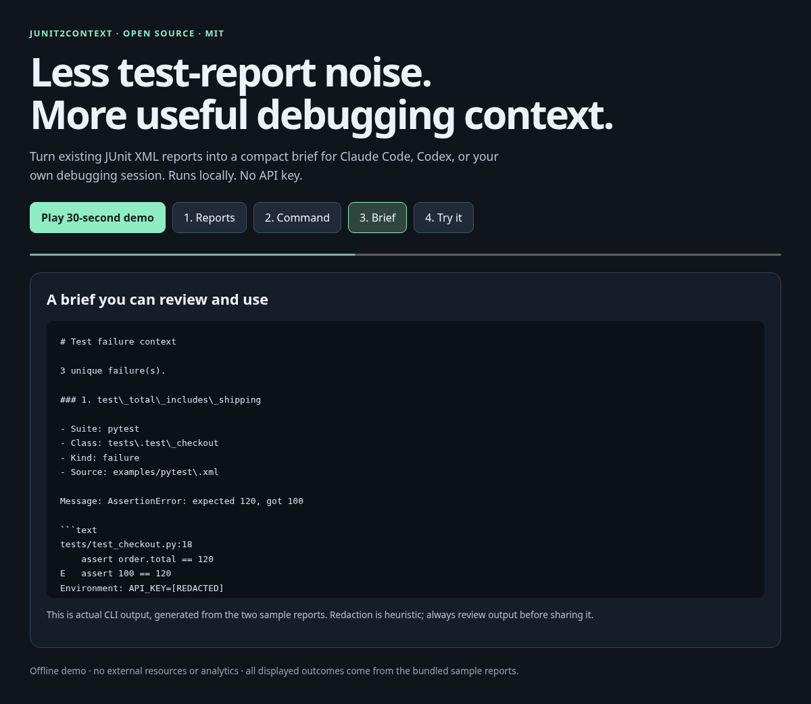

# junit2context

**Turn noisy JUnit XML into a focused brief for your next debugging session.**

[](LICENSE)

[Français](docs/README.fr.md) · [Contributing](CONTRIBUTING.md) · [Roadmap](docs/ROADMAP.md)

Test runners already produce structured failure reports. `junit2context` extracts the failed tests, deduplicates repeated failures, masks common secret patterns, and writes Markdown that you can inspect and paste into an AI coding assistant—or read yourself.

It runs locally with the Python standard library. No model, API key, network request, or test execution is involved.

## Watch the local demo

Open [docs/demo.html](docs/demo.html) from your downloaded checkout in a browser. The interactive 30-second demo works offline and displays actual CLI output from the bundled fixtures. On GitHub, download the HTML file to play it locally.

[](docs/demo.html)

The sample reports contain 1,622 characters; their generated brief contains 864 characters, a 46.7% reduction on these fixtures. These are character counts for a demonstration, not a benchmark or token estimate. See the [generated brief](examples/brief.md), or regenerate both files with `python3 scripts/build_demo.py`.

## Try it

Requires Python 3.10 or newer.

```bash
git clone https://github.com/HafidIdrissi/junit2context.git
cd junit2context
python3 -m venv .venv
.venv/bin/python -m pip install -e .
.venv/bin/junit2context examples/pytest.xml examples/vitest.xml
```

On Windows, use `python` and the executables under `.venv\Scripts\` instead.

Or run directly from the checkout, without installing dependencies:

```bash
PYTHONPATH=src python3 -m junit2context examples/pytest.xml
```

Install into an isolated environment with [pipx](https://pipx.pypa.io/) if you already use it:

```bash
pipx install git+https://github.com/HafidIdrissi/junit2context.git
```

Installation currently uses this Git repository; there is no PyPI release yet.

The two bundled reports produce three unique failures. Here is an excerpt of the generated brief:

````markdown
# Test failure context

3 unique failure(s).

### 1. test\_total\_includes\_shipping

- Suite: pytest
- Class: tests\.test\_checkout
- Kind: failure
- Source: examples/pytest\.xml

Message: AssertionError: expected 120, got 100

```text
tests/test_checkout.py:18
    assert order.total == 120
E   assert 100 == 120
Environment: API_KEY=[REDACTED]
```
````

Write a brief with a maximum of 6,000 characters:

```bash
.venv/bin/junit2context examples/pytest.xml examples/vitest.xml \
  --max-chars 6000 --output failures.md
```

Read `failures.md`, then give it to your preferred assistant with a request such as:

> Explain the likely causes of these failures. Inspect the relevant code before proposing a fix, and suggest the smallest useful verification.

## What goes into the brief?

- Failed test names, suite and class context, and available failure details.
- Both JUnit `<failure>` and `<error>` records, including those inside nested or namespaced suites.
- One copy of each exact duplicate failure, even when it appears in several input files. Class names remain part of test identity, so identically named tests in different classes stay separate.
- Up to 2,000 characters of redacted details and 500 characters of the message per failure by default, plus an explicit truncation notice when needed. Truncation keeps the beginning and end so the final exception remains visible.
- An explicit omission notice when the Markdown character budget cannot fit every complete failure item. It preserves report order and stops adding items at the first that will not fit.

Test stdout and suite properties are excluded. A passing report produces a brief with no failure items. The included pytest and Vitest XML files are representative examples, not a guarantee of compatibility with every runner version. Have a report that does not work? [Help add a fixture](CONTRIBUTING.md).

## CLI

```text
junit2context report.xml [report2.xml ...] [--format markdown|json]
              [--max-chars 12000] [--max-detail-chars 2000]
              [--max-message-chars 500]
              [--max-file-bytes 10000000] [--output failures.md]
              [--fail-on-failures]
```

| Option | Behavior |
| --- | --- |
| Input files | One or more UTF-8 JUnit XML reports. |
| `--format markdown` | Default. A brief with a 12,000-character budget. |
| `--format json` | Structured output for scripts; no total-output character budget. |
| `--max-chars N` | Limit the entire Markdown output; minimum `128`. Keeps complete failure items; reports omissions. |
| `--max-detail-chars N` | Limit each redacted detail field before adding a truncation notice, in both formats; default `2000`. |
| `--max-message-chars N` | Limit each redacted message before adding a truncation notice, in both formats; default `500`. |
| `--max-file-bytes N` | Maximum size of each input report; default `10000000` bytes. |
| `--output PATH` | Write atomically to a file instead of stdout. Replaces an existing output file; rejects overwriting an input report. |
| `--fail-on-failures` | Exit with status `1` if failures or errors are present. |

An explicitly supplied `--max-chars` is not supported with JSON and returns an error. Values below the Markdown budget minimum also return an error.

```bash
# Structured output
.venv/bin/junit2context examples/pytest.xml --format json --output failures.json

# Signal reported test failures to a script
.venv/bin/junit2context examples/pytest.xml --fail-on-failures
```

JSON output has `schema_version`, `failure_count`, `truncated_details`, `truncated_messages`, and `failures` fields. Each failure contains `source`, `suite`, `classname`, `name`, `kind`, `message`, and `details`. The truncation counts indicate how many records had text shortened; the corresponding fields include omission notices.

Exit status is `0` on successful conversion, including reports with failing tests; `1` means reported failures when `--fail-on-failures` is enabled; `2` means an input, option, or output error. Errors are written to stderr.

A report that claims failures or errors but contains no `<failure>` or `<error>` records is rejected as incomplete.

## Privacy and scope

Redaction is a heuristic applied to report fields, including names and failure text. It can miss credentials and other sensitive data, and it can mask harmless text. **Review the output before sharing it.** See [SECURITY.md](SECURITY.md).

The character limit is not a token limit. Failure details remain untrusted report content; an assistant should treat them as data, not instructions. This tool prepares context and does not diagnose or fix your code.

## Contribute

The most useful contributions are small, reproducible improvements:

- Add a sanitized JUnit fixture from a runner you use, with a regression test.
- Report a failure that disappears, appears twice, or loses important context.
- Improve redaction with synthetic examples of both sensitive and harmless text.
- Improve the Markdown brief for real debugging workflows.

Start with [CONTRIBUTING.md](CONTRIBUTING.md) and the [roadmap](docs/ROADMAP.md). No account with an AI provider is needed to develop or test this project.

Maintainers can use the [launch checklist](docs/LAUNCH.md) and [starter issue drafts](docs/STARTER_ISSUES.md) to collect feedback and coordinate contributions.

```bash
PYTHONPATH=src python3 -m unittest discover -s tests -v
```

Released under the [MIT license](LICENSE). Created by [Hafid Idrissi](https://github.com/HafidIdrissi).
